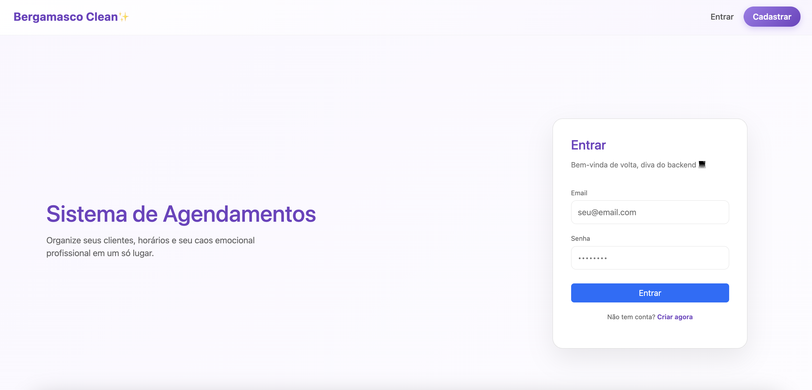
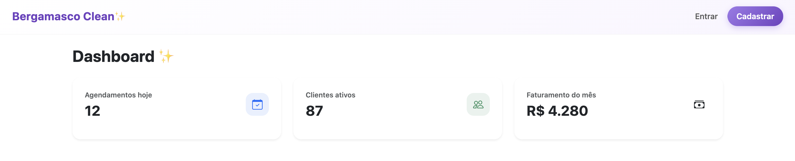

# 💎 Sistema de Agendamentos 🌸✨

🌸 [📖 Documentação Completa no Notion](https://www.notion.so/Sistema-de-Agendamentos-Documenta-o-T-cnica-Oficial-2ca1128664c08054850fd8862129eb4f)  
🌸 [🔗 Repositório GitHub](https://github.com/amandavicberg/sistema-agendamentos)

---

## 🎀 Badges 💖

  
  
  
  
  

---

## 🧩 Visão Geral 💜

✨ Sistema completo para gerenciamento de:

- 👤 **Clientes**  
- 🛠 **Serviços**  
- 📅 **Agendamentos**  

Com:

- 💻 API RESTful em **ASP.NET Core (.NET 8)**  
- 💾 Persistência real em **SQL Server**  
- 🔐 Autenticação via **JWT**  
- 🎨 Frontend em **Vue 3 + JavaScript + Bootstrap**  
- 🏗 Arquitetura limpa, modular e evolutiva  

---

## 🏗 Estrutura do Projeto 💖
```bash
SistemaAgendamentos/  
├─ **SistemaAgendamentos.Api/**      # Backend ASP.NET Core  
│  ├─ Controllers/  
│  ├─ Data/  
│  ├─ Dtos/  
│  ├─ Models/  
│  ├─ Service/  
│  ├─ Program.cs  
│  └─ appsettings.json  
├─ **SistemaAgendamentos.Web/**      # Frontend Vue 3  
│  ├─ src/  
│  │  ├─ api/                   # Axios configurado  
│  │  ├─ components/            # Componentes Vue  
│  │  ├─ stores/                # Pinia stores  
│  │  ├─ views/                 # Telas  
│  │  ├─ router/  
│  │  ├─ App.vue  
│  │  └─ main.js  
│  └─ package.json  
└─ README.md  
```
---

## 🚀 Como Rodar 💖

### Pré-requisitos 🌸

- .NET 8 SDK  
- SQL Server  
- Node.js ≥ 18  
- npm  

---

### 1️⃣ Rodando o Backend 💻
```bash
cd SistemaAgendamentos.Api 
```

- Configure a string de conexão no `appsettings.json`:  
```json
Server=localhost;Database=SistemaAgendamentosDb;User Id=sa;Password=SuaSenhaAqui;TrustServerCertificate=True
```

- Crie e aplique as migrations:  
```bash
dotnet ef migrations add InitialCreate  
dotnet ef database update  
```

- Rode a API:  
```bash
dotnet run  
```

API disponível em: `https://localhost:5001`

---

### 2️⃣ Rodando o Frontend 🎨
```bash
cd SistemaAgendamentos.Web  
npm install  
npm run dev  
```

Frontend disponível em: `http://localhost:5173`

---

### 3️⃣ Testando o Login ✨

Credenciais do admin seedado:  

Email: **admin@teste.com**  
Senha: **123456**  

Faça login para acessar a **Home** e **Dashboard**.

---

## 🧠 Funcionalidades 💜

- 👩‍💻 Cadastro de clientes, serviços e agendamentos  
- 🕒 Controle de status de agendamento: **Pendente**, **Confirmado**, **Cancelado**, **Concluído**  
- 🔐 Login JWT com rotas protegidas  
- 💾 CRUD completo com persistência SQL Server  
- 👑 Seed de usuário admin  
- 💅 Frontend funcional, responsivo e modular  

---

## ⚙️ Stack Técnica 💖

### Backend 🌸

- ASP.NET Core Web API (.NET 8)  
- Entity Framework Core  
- SQL Server  
- JWT Authentication  
- Swagger  
- Arquitetura em camadas (Controller → Service → Data)

### Frontend 🎀

- Vue 3  
- JavaScript  
- Bootstrap 5  
- Axios  
- Pinia  
- Vue Router

---

## 💅 Status do Projeto ✨

**Backend:** Limpo, relacional, seguro, evolutivo  
**Frontend:** Bonito, funcional, modular, pronto pra crescer  

---

## 🌸 Galeria do Projeto 💖

✨ **Screenshots do Projeto (em andamento)** ✨  

<div align="center">

**💌 Tela de Login**  
--


<br>

**📊 Dashboard**  
--


<br>

</div>

---

> 🌸 Projeto divertido, elegante e pronto pra brilhar! 💻💖💜  
> 🚧 Ainda em desenvolvimento, novas funcionalidades a caminho!
